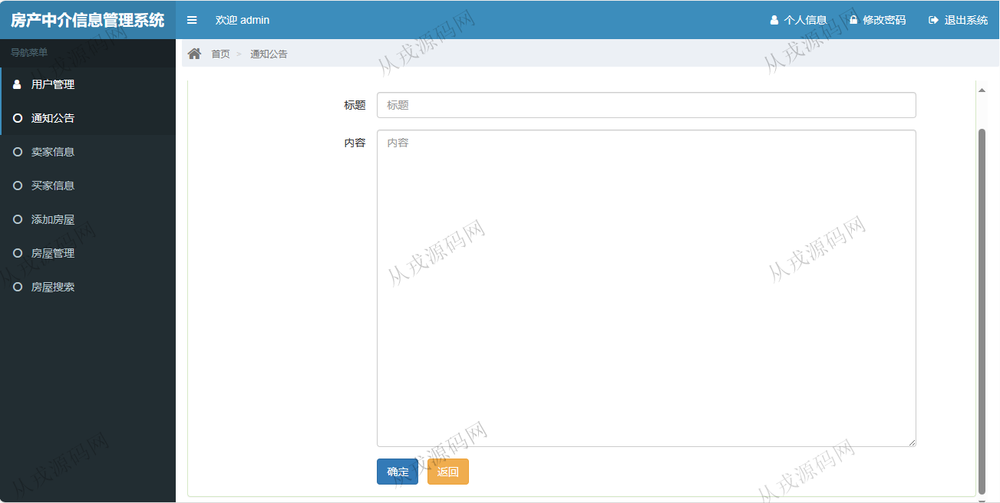
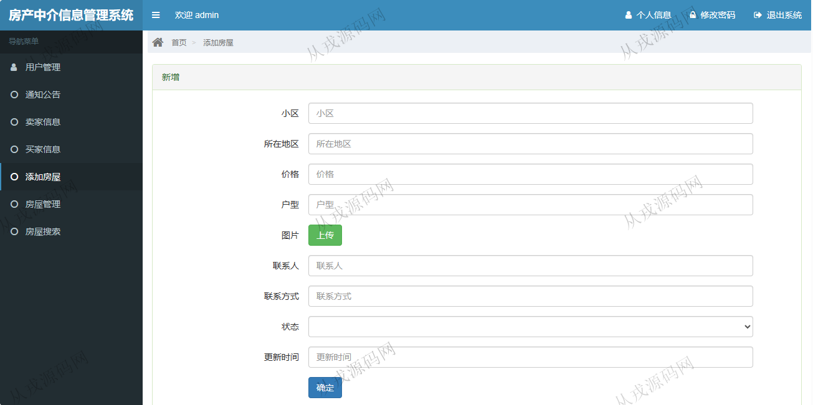
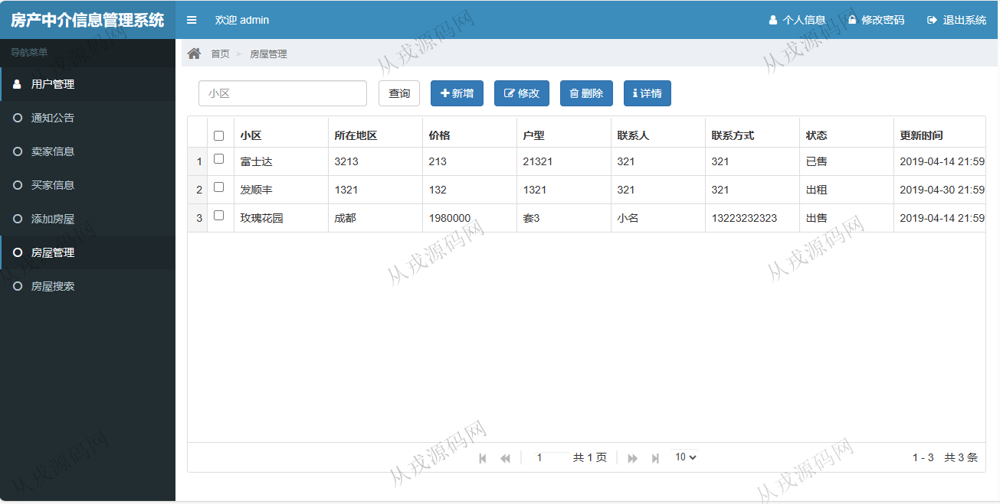
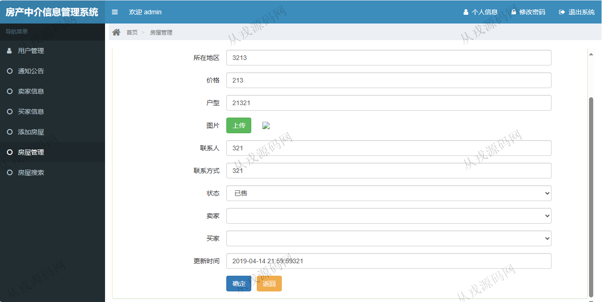
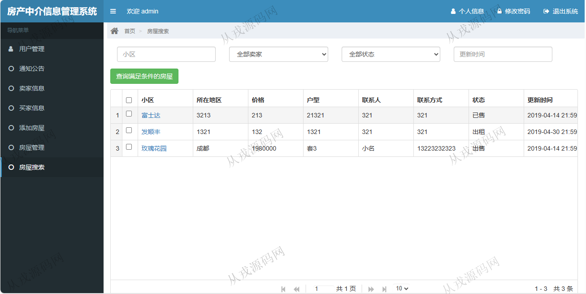

<h1 align="center">135.房产中介信息管理系统</h1>

 获取sql文件 QQ: 386869957 QQ群: 377586148 

 [更多源码项目: 从戎源码网](https://armycodes.com/) 

## 简介

> 本代码来源于网络,仅供学习参考使用!
>
> 提供1.远程部署/2.修改代码/3.设计文档指导/4.框架代码讲解等服务
>
> 访问地址：http://localhost:8080/
> 
> 管理员：admin 123456
> 
> 员工：员工1 123456
>

## 项目介绍
基于ssm的房产中介信息管理系统：前端 html、jquery、layui，后端 maven、springmvc、spring、mybatis；角色分为管理员、员工；集成卖家信息，买家信息，房屋管理等功能于一体的系统。

## 功能介绍

- 用户管理：用户信息的增删改查，按用户名搜素
- 通知公告：公告信息的增删改查，关键词搜索
- 卖家信息：卖家信息的增删改查，关键词搜索
- 买家信息：买家信息的增删改查，关键词搜索
- 房屋管理：房屋信息的增删改查，按小区名称搜索，房屋图片上传
- 房屋搜索：房屋列表查询，查询满足条件的房屋信息

## 环境

- <b>IntelliJ IDEA 2021.3</b>

- <b>Mysql 5.7.26</b>

- <b>Tomcat 7.0.73</b>

- <b>JDK 1.8</b>

## 运行截图

